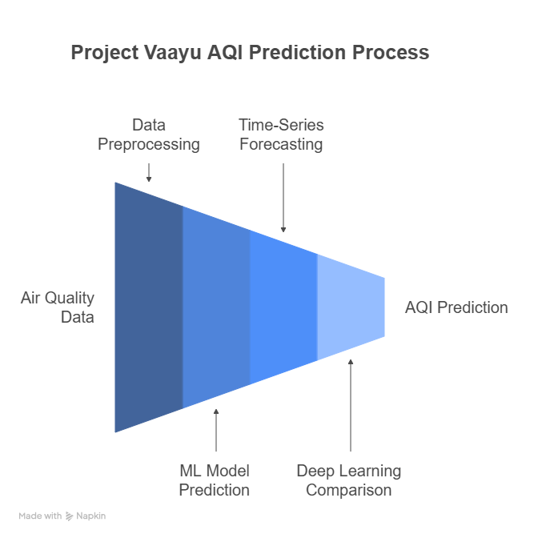

#  Project Vaayu — Predictive Air Quality Intelligence

**Project Vaayu** is a comprehensive, multi-phase initiative focused on accurate and scalable Air Quality Index (AQI) prediction and forecasting. Spanning classical machine learning, statistical time-series analysis, and deep learning architectures, the project aims to identify the most effective modeling approach for environmental health forecasting in Indian urban regions—specifically Hyderabad.

---

## 🔍 Project Structure and Goals

Project Vaayu is divided into three distinct but interrelated phases:

---

### 🧩 Phase 1: ML-Based AQI Prediction and Model Benchmarking

This phase focuses on building and comparing four core machine learning models:  
**Random Forest**, **XGBoost**, **CatBoost**, and **Bagging Regressor**

- Trained on 10 years of pollution data (2013–2023) from 13 CPCB monitoring stations in Hyderabad  
- Evaluated using MAE, RMSE, R², and MAPE  
- Objective: Benchmark classical ML models for AQI prediction and identify the most effective one

---

### 📈 Phase 2: Time-Series AQI Forecasting with LSTM and ARIMA/SARIMA

This phase implements both classical and deep learning time-series models:

- **ARIMA** and **SARIMA** for statistical baseline forecasts  
- **LSTM** to capture long-term, non-linear temporal dependencies in AQI data  
- Models are validated for short-term AQI forecasting using real-world sequences

---

### 🤖 Phase 3: Deep Learning Architecture Evaluation (LSTM vs GRU)

This segment explores deep learning techniques for AQI prediction:

- Compares **LSTM** and **GRU** architectures  
- Evaluates generalization, convergence speed, and accuracy  
- Trained on normalized sequential data using dropout, batch norm, and early stopping

---

## 🎯 Why Project Vaayu?

> With urban air quality becoming a critical public health issue, Project Vaayu provides a data-driven, modular, and extensible framework for AQI prediction that can power smart city dashboards, alert systems, and long-term planning tools.

---

## 🔄 Workflow Overview

